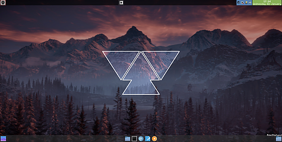
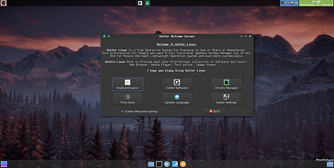
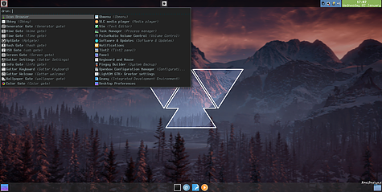
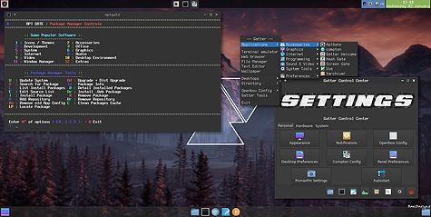

    
    

## Contents
- [Intro](#intro)
- [ScreenShots](#screenshots)
- [Applications](#applications)
- [Shortcuts](#shortcuts)
- [Donate](#donate)

## Intro 
- Gatte Linux is a GNU/Linux Distrobution base on ubuntu LTS.
- Gatter Linux is fast, lightweight, full customizable distrobution built around openbox window manager with minimal Application Collations 
- Gatter Linux Give you lot of scripts to make your time with it easier and much more fun 

## ScreenShots 

## Applications 

- [Openbox Window Manager](http://www.openbox.org) : standards-compliant, fast, light-weight and extensible window manager
- [Lxterminal]( http://www.lxde.org/) : LXTerminal is a VTE-based terminal emulator for the Lightweight X11 Desktop Environment (LXDE).
- [Chromium Browser](https://chromium.googlesource.com/chromium/src/) : Chromium web browser, open-source version of Chrome
- [PcmanFm](http://pcmanfm.sourceforge.net/) : extremely fast and lightweight file manager
- [Geany](http://www.geany.org) : Geany is a small and lightweight integrated development environment.
- [g-wall]() : Wallpaper Manager for Gatter Linux 

## Shortcuts

- `Ctrl+Alt+t`  - Terminal Emilator
- `Alt+b`       - Web Browser
- `Alt+h`       - File Manager
- `Alt+e`       - Text Editor 
- `Alt+w`       - Wallpaper Manager

## Donate

- [PayPal](https://www.paypal.me/ZGatter/5)
- [Patreon](https://www.patreon.com/user?u=16191162)
